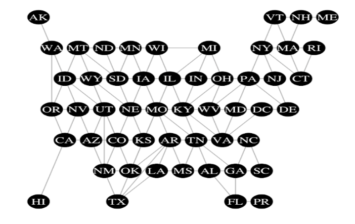

```{r setup, include=FALSE}
knitr::opts_chunk$set(echo = TRUE)
```

# Definitions

We first provide definitions for values used in the distance calculation.

## Functions

Throughout this section, Let $I(Variable1 != Variable2)$ be 1 when $Variable1$ is not the same as $Variable2$, 0 when $Variable1$ = $Variable2$.

### Nonprofit Attributes

For any nonprofit, Organization $i$, we define the following characteristics:

-   $OrgType_i$, $BroadCategory_i$, $MajorGroup_i$, $TwoDigit_i$, $Division_i$, and $SubDivision_i$ be the values listed in the Disaggregated NTEE Codes section of the NTEE codes Vignette.

-   $LocationType_i$ - "metro", "suburban", "town", or "rural", what type of city is Organization $i$ located in? See [City Type Vignette](city-type.html) for how this value is determined.

-   $TotalExpense_i$ be the total annual expenses of Organization $i$ the most recent IRS filing year.

Define similar values of Organization j.

### Modified Contiguous USA Graph

To calculate distances between US states and territories we consider the graph distance on a Modified Contiguous USA Graph. We construct a graph as follows: each state or territory is represented as a node in the graph, and there is an edge between two nodes if their respective states share a border. In this graph, we consider Alaska connected to Washington, Hawaii connected to California, Puerto Rico connected to Florida, and Washington D.C. is connected to Maryland and Virginia. The resulting graph is as follows:



The distance between two states is the length of the shortest path between their respective nodes. Distance between states can be understood as the number of state borders that you would need to cross if you were to drive from state A to state B. For example, this distance between Illinois and Arizona is 4 because the shortest path is from Illinois, Missouri, Kansas, Colorado, then Arizona.

Note, the minimum distance is 0 and maximum distance between 2 nodes is 12. The locations pairs with distances of 12 are Alaska and Maine, and Hawaii and Maine.

We note that because the distance on the Modified Contiguous USA graph is simply a graph distance, this distance clearly satisfies the definition of a distance metric as it satisfies non-negativity, reflexivity, symmetry, and the triangle inequality.

# Distance Calculation

The similarity distance between Organization $i$ and Organization $j$ is a distance measure comprising three parts: mission distance, geographic distance, and size difference.

### Mission Distance

We use five attributes to calculate the mission distance between Organization $i$ and Organization $j$.

##### 1. Organization Type

$$M_{1 , ij} = I( OrgType_i !=OrgType_j )$$

##### 2. Broad Category

$$M_{2 , ij}  = I( BroadCategory_i != BroadCategory_j )$$

##### 3. Major Group

$$M_{3 , ij} = \begin{cases} 1  & \text{ if } M_{2 , ij} = 1 \\ I( MajorGroup_i != MajorGroup_j ) & \text{ if } M_{2 , ij} = 0 \end{cases}$$

##### 4. Division

$$M_{4 , ij}   = \begin{cases} 1  & \text{ if } M_{3 , ij} = 1 \\ I( Division_i != Division_j ) &  \text{ if }M_{3 , ij} = 0 \end{cases}$$

##### 5. Subdivision

$$M_{5 , ij}   = \begin{cases} 1  & \text{ if } M_{4 , ij} = 1 \\ I( SubDivision_i != SubDivision_j ) &  \text{ if }M_{4 , ij} = 0 \end{cases}$$

##### Total Mission Distance

Then, the final mission distance for two organizations is,

$$\begin{align*}
MissDist_{ij} &= log_{10}\{ (M_{1 , ij}  * WM_1) +(M_{2 , ij}  * WM_2) +(M_{3 , ij}  * WM_3) \\
&\quad \quad \quad \quad+(M_{4 , ij}  * WM_4) + (M_{5 , ij } * WM_5)+ 1 \}
\end{align*}$$

Where $WM_1$, $WM_2$, $WM_3$, $WM_4$, and $WM_5$ are the mission weights. See Section "Weights" below for details.

### Geography

We use two values to calculate the geographic distance between Organization $i$ and Organization $j$.

##### 1. City Location Type Define,

$$Code_i = \begin{cases}
111 & \text{ if } LocationType_i = ``metro” \\
110 & \text{ if } LocationType_i = ``suburban” \\
100 & \text{ if } LocationType_i = ``town” \\
000 & \text{ if } LocationType_i = ``rural” \\
\end{cases}$$

and let $Code_{1, i}$ , $Code_{2, i}$ , and $Code_{3, i}$ be the first, second, and third digits, of $Code_i$ , respectively.

Similarly, define $Code_j$, $Code_{1, j}$ , $Code_{2, j}$ , and $Code_{3, j}$.

Then, the geographic distance attributed to the city location type is,

$$G_{1, ij}= I( Code_{1, i} !=Code_{1, j} ) +I( Code_{2, i} !=Code_{2, j} ) +I( Code_{3, i} !=Code_{3, j} )$$ Since $G_{1, i j}$ is symmetric in $i$ and $j$, there are seven unique combinations of Location Types for $G_{1, i j}$ which we list here.

-   When $LocationType_i = LocationType_j$, then $G_{1, ij} = 0$.
-   When $LocationType_i =$ "metro" and $LocationType_j =$ "subruan", $G_{1, ij} = 1$,
-   When $LocationType_i =$ "metro" and $LocationType_j =$ "town", $G_{1, ij} = 2$,
-   When $LocationType_i =$"metro" and $LocationType_j =$ "rural", $G_{1, ij} = 3$,
-   When $LocationType_i =$ "suburban" and $LocationType_j =$ "town", $G_{1, ij} = 1$,
-   When $LocationType_i =$ "suburban" and $LocationType_j =$ "rural", $G_{1, ij} = 2$,
-   When $LocationType_i =$ "town" and $LocationType_j =$ = "rural", $G_{1, ij} = 1$.

##### 2. State

Let $StateGraphDist_{ij}$ be the distance between the state/territory Organization $i$ is located in and the state/territory Organization $j$ is located in using the Modified Contiguous USA Graph defined above. Define,

$$G_{2, ij}= StateGraphDist_{i j}.$$

##### Total Geographic Distance

Then, the final geographic distance between the two organizations is,

$$GeoDist_{ij}=log_{10}\{ (G_{1, ij} * WG_1 ) +( G_{2, ij} * WG_2 ) + 1 \}.$$

### Size

The distance in size between Organization i and Organization j is calculated as:

$$SizeDist_{ij} = log_{10}( |TotalExpense_i - TotalExpense_j |  + 1).$$

If any information needed to calculate this value is missing we assign $SizeDist_{ij} = max_{i'.j'}( SizeDist_{i'j'})$ where $i’$ and $j’$ are all potential pairs of nonprofits that are being compared.

#### Weights

The current weight values are set at

| Mission Weights | Geographic Weights |
|:---------------:|:------------------:|
|   $WM_1 = 4$    |     $WG_1 = 1$     |
|   $WM_2 = 4$    |     $WG_2 = 1$     |
|   $WM_3 = 3$    |                    |
|   $WM_4 = 2$    |                    |
|   $WM_5 = 1$    |                    |

Need to add reasoning

### Total Distance Score     

To calculate the overall distance we first find,  

* $MinMiss = min_{i' j'}  (MissDist_{i' j'} )$ 
* $MinGeo= min_{i' j'}  (GeoDist_{i' j'} )$ 
* $MinSize = min_{i' j'}  (SizeDist_{i' j '})$

Then, the total distance is defined as 

$$TotalDist_{i j}  =\frac{100}{3} (MissDist_{ij}  - MinMiss) + \frac{100}{3}(GeoDist_{ij} - MinGeo)  +
\frac{100}{3}(SizeDist_{ij}  - MinSize). $$

By this definition, pairs of organizations with $TotalDist_{ij}=0$ are the most similar of all potential pairs, and pairs of organizations with  $TotalDist_{ij}=100$ are the most different. 

In this definition mission, geography, and size are weighted equally when calculating the total distance. This implies that these three attributes are equally important when finding the distance between two organizations. 

However, if you believe that the three attributes are not equally important, it is possible to update the total distance formula to reflect this. The current total distance is in the form of an average. We can instead use a weighted  average using weights respective to their importance. For example if, you believed mission was twice as important as geography or size, and geography and size are equally important, your new total distance formula would be

$$TotalDist_{i j}  =\frac{100}{2} (MissDist_{ij}  - MinMiss) + \frac{100}{4}(GeoDist_{ij} - MinGeo)  +
\frac{100}{4}(SizeDist_{ij}  - MinSize). $$
