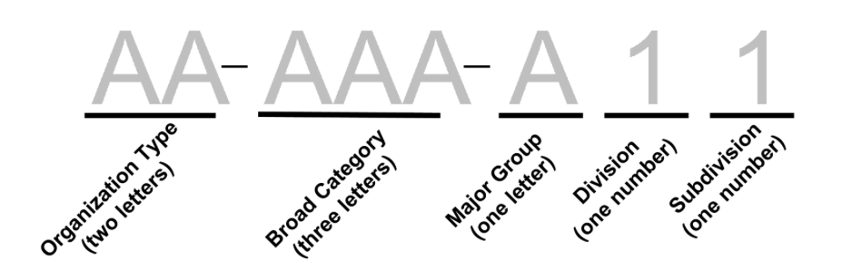

```{r setup, include=FALSE}
knitr::opts_chunk$set(echo = TRUE)
library(compensator)
library(dplyr)
library(kableExtra)
```

National Taxonomy of Exempt Entities (NTEE) Code system is used by the
IRS and NCCS to classify nonprofit organizations. It is also used by the
Foundation Center to classify both grants and grant recipients
(typically nonprofits or governments). NCCS and the IRS use the NTEE-CC
system, described below, while the Foundation Center uses a slightly
different version with more codes, as well as "population/beneficiary"
codes to indicate the type of population served and "auspice" codes to
indicate religious or governmental affiliation.

Both the structure and the interpretation of an NTEE code varies by the
type of nonprofit it describes, regular or specialty. Most nonprofits
are regular organizations. These are organizations that .... . Some
nonprofits are specialty organizations. Specialty organizations are
those whose primary mission is to provide advocacy, research,
fundraising, and/or technical assistance to separate nonprofit(s).

# Original NTEE Code Structure

## Regular Nonprofits

Regular nonprofits have NTEE codes with three characters, one letter
followed by two numbers. The letter represents the major group, the
first number represents the division, and the second number represents
the subdivision. Subdivisions are nested inside divisions, which are
nested inside major groups, which are nested inside broad categories.
There are a total of 26 major groups nested inside 12 broad categories.
Each major group contains between 1 and 8 divisions, and each division
contains between 1 and 10 subdivisions.

The 26 major groups and their corresponding letters are:

```{r, echo = F}
ntee.orig %>%
  dplyr::filter(nchar(ntee) ==1) %>%
  dplyr::select(-definition) %>%
  dplyr::rename(`NTEE Major Group` = ntee,
                Description = description) %>%
  kable() %>%
  kable_styling()

```

The NTEE classification system divides the universe of nonprofit
organizations into 26 major groups (letters A - Z) under 12 broad
categories (numbers 1-12) as follows: 
  
1. Arts, Culture, and Humanities (ART) - A 

2. Education (EDU) - B, excluding NTEE codes B40, B41, B42, and B43 

3. Environment and Animals (ENV) - C, D 

4. Health (HEL) - E, F,G, H, excluding NTEE codes E20, E21, E22, and E24 

5. Human Services(HMS)- I, J, K, L, M, N, O, P 

6. International, Foreign Affairs (IFA) - Q 

7. Public, Societal Benefit (PSB) - R, S, T, U, V, W 

8. Religion Related (REL) - X 

9. Mutual/Membership Benefit (MMB) - Y 

10. Unknown, Unclassified (UNU)- Z 

11. Universities (UNI) - NTEE codes B40, B41, B42,and B43 

12. Hospitals (HOS) - NTEE codes E20, E21, E22, and E24

Universities and hospitals have been separated in different broad
categories from the rest of their respective major groups due to their
differences in size and scope of mission. Divisions range from 2 - 9,
and subdivisions range from 0 - 9. Thus, the two digits for a NTEE code
for any regular nonprofit will range from 20 to 99. Divisions are only
interpretable within major groups. For example, consider A20 and B20.
The division in each of these codes (first digit, "2") has a different
interpretation because their major groups (letters A and B,
respectively) are different. Similarly, subdivisions are only
interpretable within divisions. For example, consider P21 and P31. The
subdivision in each of these codes (second digit "1") has a different
interpretation because their divisions (first digits "2" and "3",
respectively) are different, even though they are within the same major
group. For a full list of divisions and subdivisions see the list of
NTEE all regular codes here.

All regular NTEE codes are listed in the `ntee.orig` data set. 

## Speciality Nonprofits

The primary difference between regular and specialty NTEE codes is the
structure of the divisions. All specialty nonprofits must have an NTEE
code with a minimum of three characters, one letter followed by two
numbers. Just as with regular nonprofits, the letter represents the
major group. However, the two numbers do not have the same
interpretation as regular nonprofits. For specialty nonprofits, the two
numbers together represent the type of support the nonprofit provides.
There are only seven options for these two numbers,

-   01 - Alliance/Advocacy Organizations (AA)
-   02 - Management and Technical Assistance (MT)
-   03 - Professional Societies/Associations (PS)
-   05 - Research Institutes and/or Public Policy Analysis (RP)
-   11 - Monetary Support - Single Organization (MS)
-   12 - Monetary Support - Multiple Organizations (MM)
-   19 - Nonmonetary Support Not Elsewhere Classified (NS)

Here we can see that across all major groups, any NTEE code with its two
digits less than 20 describes a specialty nonprofit, and any NTEE code
with its two digits greater than or equal to 20 describes a regular
nonprofit.

Specialty organizations have the option to have a five character NTEE
code, one letter followed by four digits. The letter describes the major
group, the first two digits are any of the seven options above
describing the type of support the nonprofit provides, then the last two
digits represent the division and subdivision, respectively, of the
nonprofit they provide support to. For example, B1140 would designate a
nonprofit that provides college and university fundraising under B11
Monetary Support, and the "40" was chosen from the B40 division and
subdivision representing Higher Education Institutions. Conversely, high
school booster clubs would be classified as B1120 (B11 Monetary
Support - Single Organization plus B20 Elementary, Secondary Education,
K-12).

Another example of coding is a professional society called "The Learned
Society of Landscape Photographers" would be given an NTEE code of
A0340; the major group is A for Arts, the common code 03 designates the
organization as a professional society and the last two digits ("40")
signifies visual arts organizations. An organization that raises funds
for a specific organization, such as a single hospital ("Friends of St.
Christopher Hospital") receives a code of E1120; an organization that
raises funds for several hospitals ("Friends of Memphis Hospitals")
receives a code of E1220. Specialty NTEE codes follow the same broad
category distinctions as regular NTEE codes. Because no specialty
nonprofit itself can be a university or a hospital (although they can
still provide support to universities or hospitals), no specialty NTEE
code will have a broad category of 11 or 12.

# NTEE Code structure 

Here we provide a visual dendrogram that captures the overall NTEE Code structure. Hover th mouse over each node to see more information. Click on each node to expand it and see the categories inside of it.


```{r, echo = F}
htmltools::includeHTML("images/ntee-dendrogram.html")
```

# Disagregated NTEE Codes

We define the Disaggregated NTEE codes to more clearly represent the
nested structure of the original NTEE codes and to have one
interpretation for both regular and specialty organizations.

## Definitions

For any nonprofit, Organization $i$ with any NTEE code, we define the
following attributes:

-   $OrgType_i \in \{RG, AA, MT, PS, RP, MS, MM, NS\}$ be the
    organization type of Organization $i$, represents Regular Nonprofit,
    Alliance/Advocacy Organizations, Management and Technical
    Assistance, Professional Societies/Associations, Research Institutes
    and/or Public Policy Analysis, Monetary Support - Single
    Organization, Monetary Support - Multiple Organizations, or
    Nonmonetary Support Not Elsewhere Classified, respectively,
    according to the list above.

-   $BroadCategory_i \in \{ART, EDU, ENV, HEL, HMS, IFA, PSB, REL, MMB, UNU, UNI, HOS\}$
    be the broad category of Organization $i$, found using the list
    above.

-   $MajorGroup_i \in \{A, B, ... , Z\}$ be the major group Organization
    $i$, which is is letter in the original NTEE code.

-   $TwoDigit_i \in \{ 00, 20, 21, ... , 99\}$ be intermediary step
    where

    -   for regular organizations $TwoDigit_i$ is the two digits in the
        original NTEE code (2nd and 3rd characters of original NTEE
        code),
    -   for specialty organizations *without* a further categorization
        (the original NTEE code is three characters), $TwoDigit_i = 00$,
        and
    -   for specialty organizations *with* a further categorization (the
        original NTEE code is five characters), $TwoDigitS_i$ is the
        last two digits of the NTEE code (4th and 5th characters of the
        NTEE code).

-   $Division_i \in \{0, 2, 3, ..., 9\}$ be the division describing the
    area that the nonprofit works in. For all organization types,
    $Division_i$ is the first digit of $TwoDigit_i$.

-   $SubDivision_i \in \{0,1, 2, 3, ..., 9\}$ be the subdivision
    describing the area that the nonprofit works in. For all
    organization types, $SubDivision_i$ is the second digit of
    $TwoDigit_i$.

Then the final disaggregated code is structured as follows:



where the first part is the two letters representing the organization
type, the second part is the three letters representing the broad
category, and the third part represents the letter of the major group,
the number of the division, and the number of the subdivision.

## Crosswalk  

A cross walk from the original NTEE codes to the disagregated NTEE codes can be found in the `ntee.crosswalk` data set. This data set includes all regular NTEE codes and all specialty NTEE codes that are known to be used. 


# References

-   [NTEE
    Codes breif explination](https://nccs.urban.org/project/national-taxonomy-exempt-entities-ntee-codes)
-   [List of all NTEE codes](https://nccs.urban.org/publication/irs-activity-codes)
